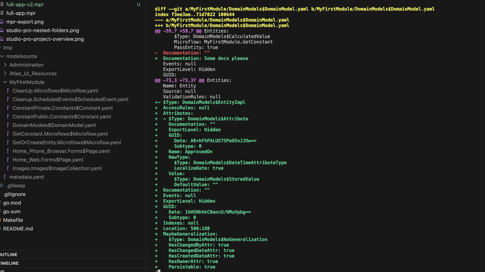
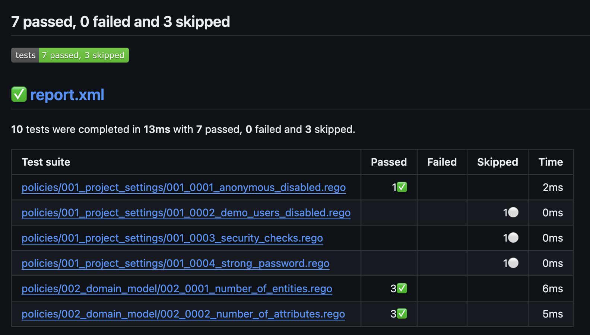

# MxLint CLI

[](https://github.com/mxlint/mxlint-cli/actions/workflows/ci.yml)
[](https://github.com/mxlint/mxlint-cli/releases/latest)
[](https://goreportcard.com/report/github.com/mxlint/mxlint-cli)
[](LICENSE)

A set of Command line interface tools for Mendix developers, CICD engineers and platform engineers.

> This project is in early development stage. Please use with caution. We are looking for contributors to help us improve the tools. Please create a PR with your changes. We believe in open ecosystem and open source. We are looking forward to your contributions. These can be documentation improvements, bug fixes, new features, etc.

## Mendix Studio Pro extension

The quickest way to try out MxLint is to use it as Mendix Studio pro extension. Follow the instructions at [mxlint-extension](https://github.com/mxlint/mxlint-extension)

## Basic Usage

mxlint-cli is a set of tools to help you with your Mendix projects. As such you can use it in many ways. To give you a feeling what it does. Try the following example:

### Prerequisites

- Mendix Project source
- Operating system: Linux, MacOS, Windows
- Download your platform specific binary from the [releases page](https://github.com/mxlint/mxlint-cli/releases)
- Download the policies from the [releases page](https://github.com/mxlint/mxlint-rules/releases) and extract them to a directory

### Export Mendix model to Yaml

- copy `mxlint-cli` to your project directory
- Open a terminal and navigate to your project directory; ideally use git-bash on Windows or Terminal on MacOS/Linux
- run `./mxlint-cli export-model`

You will see a new directory `modelsource` with the exported Mendix model in Yaml format

It's advisable to add the `mxlint-cli` file to your `.gitignore` file. This way you don't accidentally commit it to your repository.

### Lint Mendix Yaml files

- copy `policies` directory to your project directory
- run `./mxlint-cli lint --xunit-report=report.xml`

You will see a summary of the policy evaluations in the terminal and a report in the `report.xml` file. The report is in xUnit format. You can use it in your CI/CD pipeline.

Do you want to create your own policies? Please refer to our guide [Create new policy](./docs/create-new-policy.md)

## Subcommands Reference

### export-model

Export Mendix model to yaml files. The output is a text representation of the model. It is a one-way conversion that aims to keep the semantics yet readable for humans and computers.

**Usage:**
```bash
mxlint-cli export-model [flags]
```

**Flags:**
| Flag | Short | Default | Description |
|------|-------|---------|-------------|
| `--input` | `-i` | `.` | Path to directory or mpr file to export. If it's a directory, all mpr files will be exported |
| `--output` | `-o` | `modelsource` | Path to directory to write the yaml files. If it doesn't exist, it will be created |
| `--mode` | `-m` | `basic` | Export mode. Valid options: `basic`, `advanced` |
| `--filter` | `-f` | | Regex pattern to filter units by name. Only units with names matching the pattern will be exported |
| `--raw` | | `false` | If set, the output yaml will include all attributes as they are in the model |
| `--appstore` | | `false` | If set, appstore modules will be included in the output |
| `--verbose` | | `false` | Turn on for debug logs |

---

### lint

Evaluate Mendix model against rules. Requires the model to be exported first. The model is evaluated against a set of rules defined in OPA Rego files or JavaScript. The output is a list of checked rules and their outcome.

**Usage:**
```bash
mxlint-cli lint [flags]
```

**Flags:**
| Flag | Short | Default | Description |
|------|-------|---------|-------------|
| `--rules` | `-r` | `.mendix-cache/rules` | Path to directory with rules |
| `--modelsource` | `-m` | `modelsource` | Path to directory with exported model |
| `--xunit-report` | `-x` | | Path to output file for xunit report. If not provided, no xunit report will be generated |
| `--json-file` | `-j` | | Path to output file for JSON report. If not provided, no JSON file will be generated |
| `--ignore-noqa` | | `false` | Ignore noqa directives in documents |
| `--cache` | | `false` | Enable caching of lint results. When enabled, results are cached and reused if rules and model files haven't changed |
| `--verbose` | | `false` | Turn on for debug logs |

---

### serve

Run a server that exports model and lints whenever the input MPR file changes. Works in standalone mode and via integration with the Mendix Studio Pro extension.

**Usage:**
```bash
mxlint-cli serve [flags]
```

**Flags:**
| Flag | Short | Default | Description |
|------|-------|---------|-------------|
| `--input` | `-i` | `.` | Path to directory or mpr file to export. If it's a directory, all mpr files will be exported |
| `--output` | `-o` | `modelsource` | Path to directory to write the yaml files. If it doesn't exist, it will be created |
| `--mode` | `-m` | `basic` | Export mode. Valid options: `basic`, `advanced` |
| `--rules` | `-r` | `.mendix-cache/rules` | Path to directory with rules |
| `--port` | `-p` | `8082` | Port to run the server on |
| `--debounce` | `-d` | `500` | Debounce time in milliseconds for file change events |
| `--verbose` | | `false` | Turn on for debug logs |

---

### test-rules

Ensure rules are working as expected against predefined test cases. When you are developing a new rule, you can use this command to ensure it works as expected.

**Usage:**
```bash
mxlint-cli test-rules [flags]
```

**Flags:**
| Flag | Short | Default | Description |
|------|-------|---------|-------------|
| `--rules` | `-r` | `.mendix-cache/rules` | Path to directory with rules |
| `--verbose` | | `false` | Turn on for debug logs |

---

### cache-clear

Clear the lint results cache. Removes all cached lint results. The cache is used to speed up repeated linting operations when rules and model files haven't changed.

**Usage:**
```bash
mxlint-cli cache-clear [flags]
```

**Flags:**
| Flag | Short | Default | Description |
|------|-------|---------|-------------|
| `--verbose` | | `false` | Turn on for debug logs |

---

### cache-stats

Show cache statistics. Displays information about the cached lint results, including number of entries and total size.

**Usage:**
```bash
mxlint-cli cache-stats [flags]
```

**Flags:**
| Flag | Short | Default | Description |
|------|-------|---------|-------------|
| `--verbose` | | `false` | Turn on for debug logs |

---

## export-model

Mendix models are stored in a binary file with `.mpr` extension. This project exports Mendix model to a human readable format, such as Yaml. This enables developers to use traditional code analysis tools on Mendix models. Think of quality checks like linting, code formatting, etc.



See each Mendix document/object as a separate file in the output directory. And see the differences between versions in a version control system. Here we changed the `Documentation` of an entity and added a new `Entity` with one `Attribute`.

#### Pipeline integration

If you do not want to export the model to Yaml on your local machine, you can do it in your pipeline. Here's a high-level example:

```bash
$ ./bin/mxlint-cli-darwin-arm64 export-model -i resources/app-mpr-v1/
INFO[0000] Exporting resources/full-app-v1.mpr to modelsource
INFO[0000] Completed resources/full-app-v1.mpr

$ ./bin/mxlint-cli-darwin-arm64 lint
## policies/001_project_settings/001_0001_anonymous_disabled.rego
PASS (0.00148s) modelsource/Security$ProjectSecurity.yaml

## policies/001_project_settings/001_0002_demo_users_disabled.rego
SKIP (0.00000s) modelsource/Security$ProjectSecurity.yaml

## policies/001_project_settings/001_0003_security_checks.rego
SKIP (0.00000s) modelsource/Security$ProjectSecurity.yaml

## policies/001_project_settings/001_0004_strong_password.rego
SKIP (0.00000s) modelsource/Security$ProjectSecurity.yaml

## policies/002_domain_model/002_0001_number_of_entities.rego
PASS (0.00190s) modelsource/Administration/DomainModels$DomainModel.yaml
PASS (0.00156s) modelsource/Atlas_UI_Resources/DomainModels$DomainModel.yaml
PASS (0.00240s) modelsource/MyFirstModule/DomainModels$DomainModel.yaml

## policies/002_domain_model/002_0002_number_of_attributes.rego
PASS (0.00161s) modelsource/Administration/DomainModels$DomainModel.yaml
PASS (0.00113s) modelsource/Atlas_UI_Resources/DomainModels$DomainModel.yaml
PASS (0.00158s) modelsource/MyFirstModule/DomainModels$DomainModel.yaml
```

## lint


Lint Mendix Yaml files. This tool checks for common mistakes and enforces best practices. It uses OPA as policy engine. Therefore policies must be written in the powerful Rego language. Please refer to [Rego language reference](https://www.openpolicyagent.org/docs/latest/policy-reference/) for more information on the syntax and semantics.

### NOQA (Ignore document or specific rules)

Documents can be marked with noqa directives in the `documentation` field to skip linting. There are two supported formats:

#### Skip all rules (document-level noqa)

A specific document can be marked as "Skipped" for all rules if you have a line in the `documentation` field that starts with either `#noqa` or `# noqa` followed by an optional message (Case in-sensitive). This message will be included as "Skipped" reason in linting results.

Example:
```yaml
Documentation: |
  #noqa This document is excluded from all linting rules
```

#### Skip specific rules (rule-level noqa)

You can skip specific rules by providing a comma-separated list of rule numbers after a colon. This allows fine-grained control over which rules to ignore.

Example:
```yaml
Documentation: |
  #noqa:001_0002,001_0003 Temporarily skipping these rules due to legacy code
```

In this example, only rules `001_0002` and `001_0003` will be skipped for this document, while all other rules will still be evaluated.

**Syntax:**
- `#noqa` or `# noqa` - Skip all rules
- `#noqa:rule1,rule2,...` or `# noqa:rule1,rule2,...` - Skip specific rules
- Optional reason can be added after the rule list, separated by a space

**Notes:**
- The noqa directive is case-insensitive
- Multiple rule numbers should be separated by commas (no spaces)
- The entire line after the noqa directive will be recorded as the skip reason

#### Ignore NOQA directives (--ignore-noqa flag)

In some scenarios, you may want to run linting on all documents, including those marked with noqa directives. The `--ignore-noqa` flag allows you to temporarily disable the noqa functionality.

**Usage:**
```bash
./mxlint-cli lint --ignore-noqa
```

When this flag is set:
- All noqa directives (both document-level and rule-level) are ignored
- Documents that would normally be skipped are evaluated against all rules
- The default behavior is `false` (noqa directives are respected)

**Example scenarios:**
- **Audit mode**: Run a complete check to see all violations, even in documents marked with noqa
- **CI/CD validation**: Enforce that certain branches (e.g., production) don't rely on noqa suppressions
- **Cleanup**: Identify which noqa markers can be removed after fixing underlying issues

**Note:** When using `--ignore-noqa`, results are not cached to ensure consistency with normal linting behavior.

## serve

Run a server that exports model and lints whenever the input MPR file changes. This is works in standalone way and via integration with the Mendix Studio Pro extension.

```
./bin/mxlint-cli-darwin-arm64 serve -i . -o modelsource -r rules -p 8084
INFO[0000] Starting server on port 8084
INFO[0000] Watching for changes in /Users/xcheng/project
INFO[0000] Output directory: modelsource
INFO[0000] Rules directory: rules
INFO[0000] Mode: basic
INFO[0000] Debounce time: 500 ms
INFO[0000] HTTP server listening on 127.0.0.1:8084
INFO[0000] Dashboard available at http://localhost:8084
INFO[0000] Initial export and lint
INFO[0000] Running export-model and lint
INFO[0000] Exporting /Users/xcheng/project/App.mpr to modelsource
INFO[0000] Found 361 documents
INFO[0000] Completed /Users/xcheng/project/App.mpr
```

The serve command provides:
- A web dashboard at http://localhost:8084
- An API endpoint at http://localhost:8084/api/results for JSON results
- Automatic re-linting when files change
- Debouncing to prevent excessive processing on rapid changes

## test-rules

Rules can be written in both `Rego` and `JavaScript` format. To speed up rule development we have implemented `test-rules` subcommand that can quickly evaluate your rule against known test scenarios. The test cases are written in `yaml` format. 

```
$ ./bin/mxlint-darwin-arm64 test-rules -r resources/rules
INFO[0000] >> resources/rules/001_0002_demo_users_disabled.js 
INFO[0000] PASS  allow
INFO[0000] PASS  no_allow
INFO[0000] >> resources/rules/001_0003_security_checks.rego 
INFO[0000] PASS  allow
INFO[0000] PASS  no_allow_1
INFO[0000] PASS  no_allow_2
```

### Features

- Export Mendix model to Yaml
- Lint Mendix Yaml files for common mistakes and enforces best practices
- Watch for changes and automatically re-lint
- Serve lint results via HTTP for integration with other tools
- Microflow transformation to more readable format (advanced mode)
- Support for both Rego and JavaScript rules
- Human readable output

## TODO

- [x] Export Mendix model to Yaml
- [x] Improve output human readability
- [x] Linting for Mendix Yaml files
- [x] Create policies for linting
- [x] Output linting results in xUnit format
- [x] Support watching for changes (watch command)
- [x] Serve lint results via HTTP (serve command)
- [x] Basic microflow transformation to more readable format
- [ ] Expand test coverage
- [ ] Support incremental changes for better performance
- [ ] Improve performance for large models
- [ ] Improve error handling
- [ ] Enhance microflow transformation with pseudo code generation

## Contribute

Create a PR with your changes. We will review and merge it.

Rego files must follow the [style guide](https://github.com/StyraInc/rego-style-guide/blob/main/style-guide.md)

Make sure to run the tests before creating a PR:

```bash
make test
```

## License

This project is an initiative of CINAQ. See [LICENSE](./LICENSE). [CINAQ](https://cinaq.com) is a registered trademark of CINAQ B.V.. Mendix is a registered trademark of Mendix B.V. All other trademarks are the property of their respective owners.
